# UDM Pipeline — Visuals

System-level diagrams in Mermaid. Renders in GitHub, VS Code, most modern markdown viewers. Source-controlled with the rest of the docs.

## 1. CDC append vs Snapshot vs SCD2 — clarification

The most common misunderstanding on the team. This pipeline does **snapshot data**, not traditional CDC append. The distinction matters for how we document the system to other engineers.

```mermaid
graph TB
    subgraph TraditionalCDC["Pattern A: Traditional CDC Append (NOT what we do)"]
        A1["Source mutation occurs<br/>(INSERT, UPDATE, DELETE)"]
        A1 --> A2["DB log captures the EVENT"]
        A2 --> A3["Append-only event log<br/>op=I/U/D, before/after, LSN"]
        A3 --> A4["Each row in log = a CHANGE"]
    end
    
    subgraph SnapshotData["Pattern B: Snapshot Data (what we do)"]
        B1["Pipeline schedule fires<br/>(02:00 AM, 17:00 PM)"]
        B1 --> B2["Extract full row state<br/>via windowed query"]
        B2 --> B3["Per-run Parquet file<br/>tokens replace PII"]
        B3 --> B4["Each row in Parquet = a STATE OBSERVATION"]
    end
    
    subgraph SCD2["Pattern C: SCD2 in Bronze (downstream of snapshot)"]
        C1["Snapshot DataFrame<br/>(in Python memory)"]
        C1 --> C2["Hash compare vs Bronze active rows"]
        C2 --> C3["Detect: new / changed / unchanged / deleted"]
        C3 --> C4["Write new Bronze versions only on actual change"]
        C4 --> C5["Each Bronze row = a STATE FOR A TIME RANGE<br/>(UdmEffectiveDateTime / UdmEndDateTime)"]
    end
    
    style TraditionalCDC fill:#ffeeee
    style SnapshotData fill:#eeffee
    style SCD2 fill:#eeeeff
```

**Key takeaway**: when an engineer says "we're doing CDC," they may mean "we're capturing changes" (true) — but the CDC pattern at the storage level is **snapshot + change detection downstream**, not append-only event log. The Stage layer that traditional CDC implementations use is removed from this pipeline.

## 2. End-to-end data flow

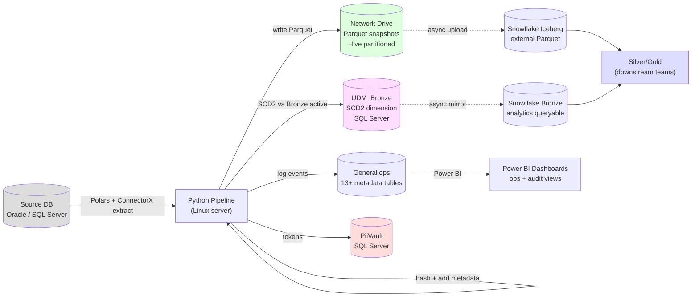

## 3. Idempotency layers

What makes a re-run produce zero net writes:

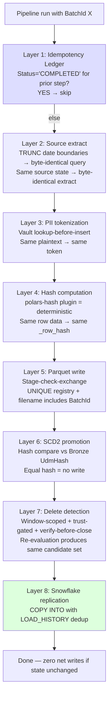

## 4. AM/PM cycle with failover and cancellation

```mermaid
sequenceDiagram
    participant Automic
    participant ProdServer as Production Server
    participant Gate as PipelineExecutionGate
    participant TestServer as Test Server
    participant Operator
    
    Note over Automic: 02:00 AM — production cycle starts
    Automic->>ProdServer: Start pipeline (AM cycle)
    ProdServer->>Gate: Acquire gate (Status=STARTING)
    ProdServer->>Gate: Update Status=RUNNING
    
    loop Every 5 min
        ProdServer->>Gate: Heartbeat (LastHeartbeatAt)
        ProdServer->>Gate: Check CancellationRequested
    end
    
    alt Production succeeds
        ProdServer->>Gate: Update Status=SUCCEEDED
        Note over Automic: 04:30 AM — test pipeline checks
        Automic->>TestServer: Start failover check (AM)
        TestServer->>Gate: Read Status
        Gate-->>TestServer: SUCCEEDED
        TestServer-->>Automic: Exit cleanly (no failover needed)
    else Production stuck
        Note over Automic: 04:30 AM — test pipeline checks
        Automic->>TestServer: Start failover check (AM)
        TestServer->>Gate: Read Status (RUNNING + stale heartbeat)
        TestServer->>Gate: Set CancellationRequested=1
        ProdServer->>Gate: Read CancellationRequested=1
        ProdServer->>ProdServer: Finish current table; release locks; flush logs
        ProdServer->>Gate: Update Status=CANCELLED
        TestServer->>Gate: Detect ack
        TestServer->>Gate: Acquire gate as test (Status=STARTING, ExecutingServer=test)
        TestServer->>Gate: Update Status=RUNNING (failover)
        TestServer->>Gate: Update Status=SUCCEEDED
    else Production stuck and doesn't acknowledge
        TestServer->>Gate: Set CancellationRequested=1
        Note over TestServer: Wait 15 min — no acknowledgment
        TestServer->>Operator: ALERT: manual intervention required
        Note over TestServer: Test does NOT proceed automatically
    end
```

## 5. PII tokenization flow

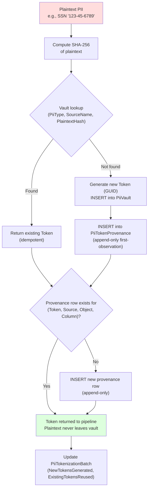

## 6. Phase dependency graph

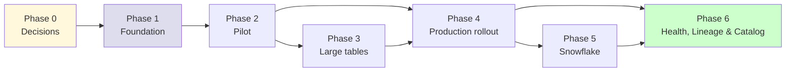

Phase 4 doesn't strictly require Phase 3 to complete — small tables can roll out before large-table support is fully ready, since they don't use the trust-gate delete logic. But large tables in Phase 4 do depend on Phase 3.

## 7. Phase 1 deep dive rounds

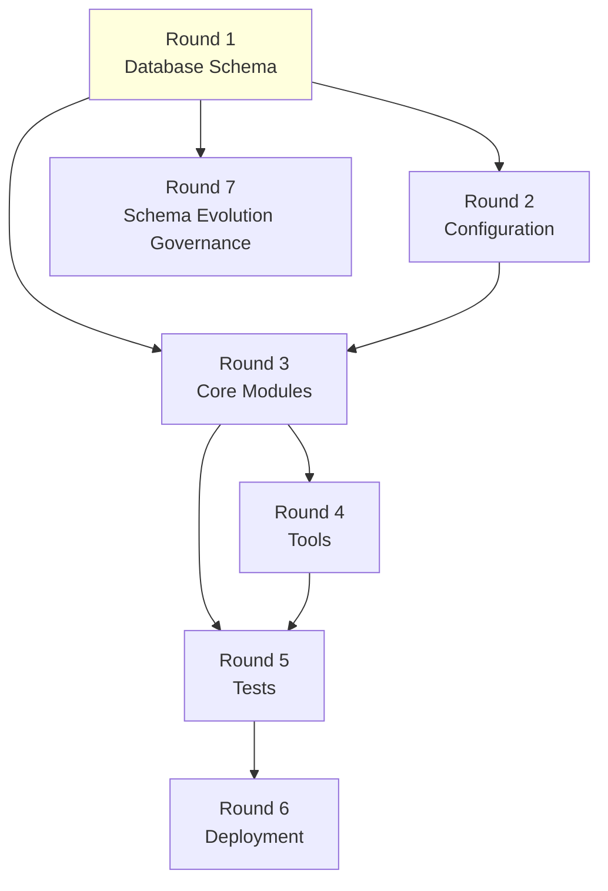

Round 1 (DDL) gates everything else. Round 2 (config) and Round 3 (modules) depend on the schema being final. Tools (Round 4) build on modules. Tests (Round 5) cover modules + tools. Deployment (Round 6) is the final gate. Schema evolution governance (Round 7) builds on the schema.

## 8. Failure recovery layered model

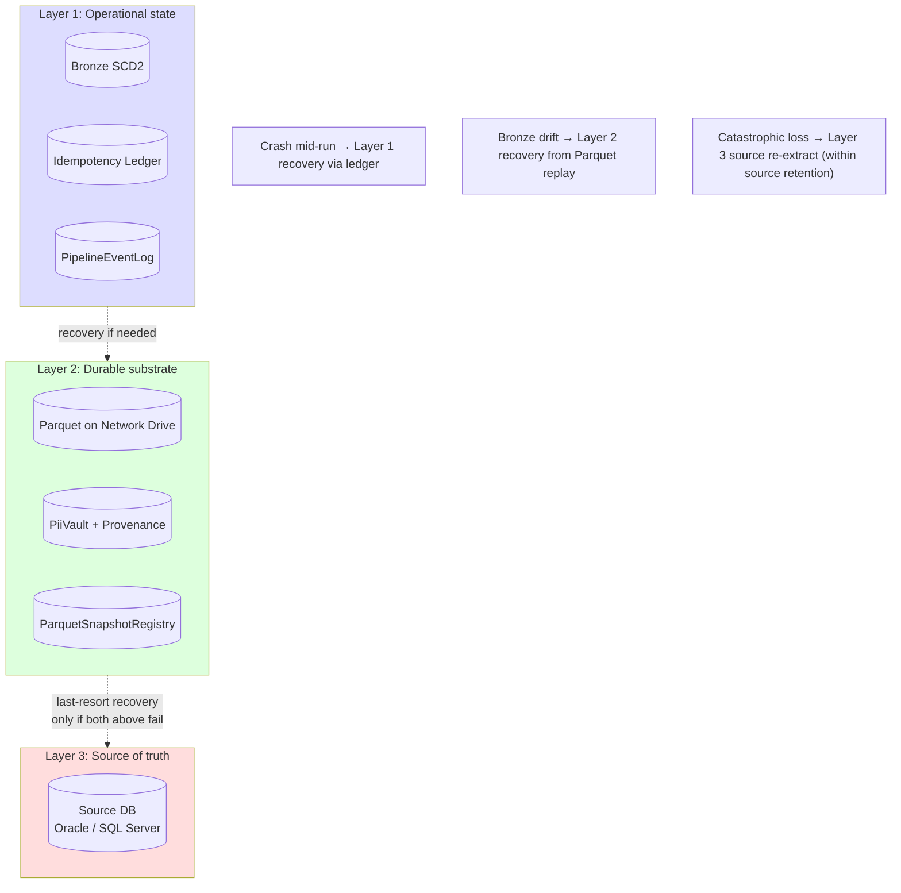

## 9. CCPA right-to-deletion data flow

```mermaid
sequenceDiagram
    participant Customer
    participant CustomerService
    participant Operator
    participant Vault as PiiVault
    participant Bronze
    participant CcpaLog as CcpaDeletionLog
    
    Customer->>CustomerService: Submit deletion request
    CustomerService->>Operator: Verified request + identifiers
    Operator->>CcpaLog: Insert request row (RequestId, identifiers)
    Operator->>Vault: Identify all tokens for plaintext identifiers
    Vault-->>Operator: Token list with LegalHold flags
    
    alt All tokens have LegalHold=0
        Operator->>Vault: UPDATE Status='deleted_per_request' for all tokens
        Vault-->>Operator: Tokens now orphan references in Bronze
        Operator->>CcpaLog: Action='deleted', ProcessedAt=now
    else Some tokens have LegalHold=1
        Operator->>Vault: UPDATE Status only for non-legal-hold tokens
        Operator->>CcpaLog: Action='partial', LegalExceptionReason
        Note over Customer: Customer notified of legal exception per CCPA
    end
    
    Note over Bronze: Bronze rows NOT physically scrubbed<br/>(audit trail preserved; tokens become orphan refs)
```

## ER diagrams — General.dbo control tier + General.ops operational metadata tier (added Round 1.5e 2026-05-11)

These ER diagrams supplement Round 1 + Round 2 schema content. They show table relationships visually for the 26 tables across both schemas (`General.dbo.*` control tier × 2 + `General.ops.*` operational metadata tier × 24). Each cluster is its own diagram for readability.

### Control tier — UdmTablesList ↔ UdmTablesColumnsList

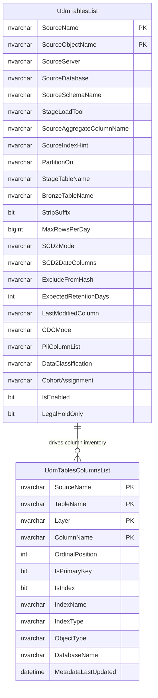

### PII / Vault / Compliance cluster

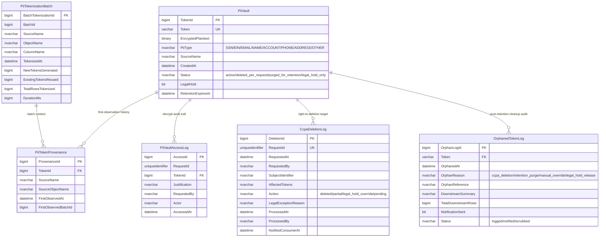

### Pipeline orchestration + state tier

```mermaid
erDiagram
    PipelineBatchSequence ||--o{ PipelineEventLog : "groups events by batch"
    PipelineBatchSequence ||--o{ PipelineLog : "groups narrative logs"
    PipelineExecutionGate ||--o{ PipelineEventLog : "gate-state observed"
    IdempotencyLedger ||--o{ PipelineEventLog : "step-state observed"
    MaintenanceWindow ||--o{ PipelineEventLog : "suppression context"
    PipelineExtraction ||--o{ DeleteEvaluationAudit : "per-day delete decisions"
    PipelineExtraction ||--o{ ExtractionGapLog : "gap detection"
    
    PipelineBatchSequence {
        bigint BatchId PK
    }
    PipelineEventLog {
        bigint EventId PK
        bigint BatchId FK
        nvarchar EventType "CLI_/CYCLE_/MIGRATION_/DEPLOYMENT_/STARTUP_/EXTRACT/CDC_PROMOTION/SCD2_PROMOTION/TABLE_TOTAL"
        nvarchar SourceName
        nvarchar TableName
        datetime StartedAt
        datetime CompletedAt
        int DurationMs
        nvarchar Status "IN_PROGRESS/SUCCESS/FAILED/SKIPPED"
        int RowsProcessed
        nvarchar Metadata "JSON"
    }
    PipelineLog {
        bigint LogId PK
        bigint BatchId FK
        nvarchar LogLevel
        nvarchar Module
        nvarchar Message
        nvarchar StackTrace
        datetime CreatedAt
    }
    PipelineExecutionGate {
        bigint GateId PK
        nvarchar CycleType "AM/PM"
        date CycleDate
        nvarchar ExecutingServer
        nvarchar Status
        datetime ActualStartTime
        datetime ActualCompletionTime
        datetime LastHeartbeatAt
        bit CancellationRequested
    }
    IdempotencyLedger {
        bigint LedgerId PK
        bigint BatchId FK
        nvarchar SourceName
        nvarchar TableName
        nvarchar EventType
        nvarchar Status
        datetime StartedAt
        nvarchar ErrorMessage
    }
    PipelineExtraction {
        bigint ExtractionId PK
        bigint BatchId
        nvarchar SourceName
        nvarchar TableName
        date DateValue
        nvarchar Status "IN_PROGRESS/SUCCESS/FAILED"
        datetime StartedAt
        datetime CompletedAt
        datetime EvaluatedAt
        bigint RowsExtracted
        bit IsReExtraction
        int ExtractionAttempt
        nvarchar FailureReason
    }
    PromotionLock {
        bigint LockId PK
        datetime LockedAt
        nvarchar LockedBy
        nvarchar Reason
        datetime ReleasedAt
        nvarchar ReleasedBy
        bit Active "computed: 1 when ReleasedAt IS NULL"
    }
    MaintenanceWindow {
        bigint WindowId PK
        datetime StartAt
        datetime EndAt
        nvarchar AffectedComponent "production_pipeline/test_pipeline/all"
        nvarchar Reason
        nvarchar CreatedBy
        datetime CreatedAt
    }
    DeleteEvaluationAudit {
        bigint AuditId PK
        bigint BatchId
        nvarchar SourceName
        nvarchar TableName
        date DateValue
        datetime EvaluatedAt
        nvarchar EvaluationOutcome "evaluated/suppressed_no_success/suppressed_all_failed/no_candidates"
        bigint AuthoritativeBatchId
        bigint BronzeActiveCount
        bigint CandidateDeleteCount
        bigint ConfirmedDeleteCount
        nvarchar SuppressedReason
    }
    ExtractionGapLog {
        bigint GapLogId PK
        nvarchar SourceName
        nvarchar TableName
        date MissingFromDate
        date MissingToDate
        nvarchar Classification "never_attempted/all_attempts_failed/beyond_source_retention"
        datetime DetectedAt
        bigint DetectedByBatchId
        nvarchar Resolution "PENDING/BACKFILLED/ACCEPTED/NO_LONGER_RECOVERABLE"
        datetime ResolvedAt
        nvarchar ResolvedBy
        nvarchar Reason
    }
```

### Snapshot + reconciliation tier

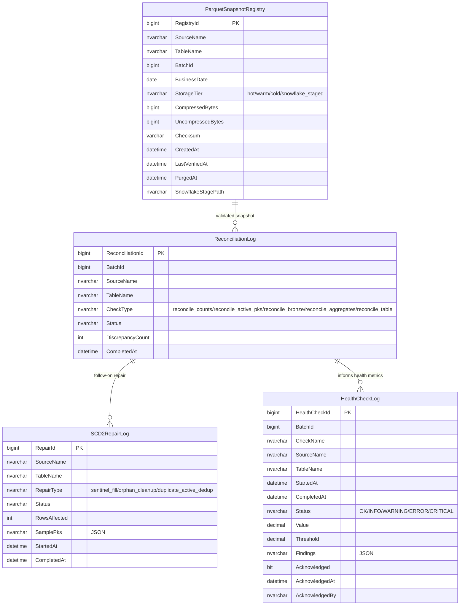

### Lifecycle + governance tier

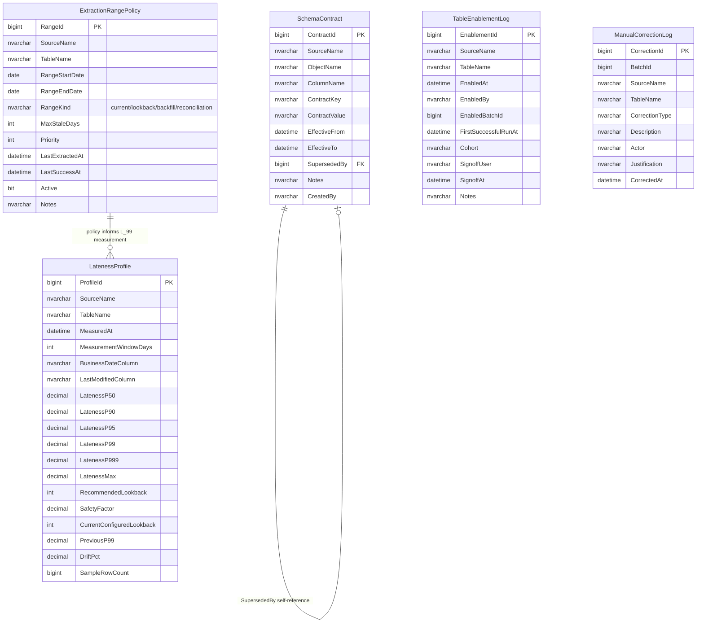

**How to read these diagrams**: each diagram shows ONE cluster of related tables. Cross-cluster joins (e.g., `PipelineEventLog.SourceName` → `UdmTablesList.SourceName`) happen at runtime via the join columns shown in each block. Column names + types match canonical Round 1 schema (`phase1/01_database_schema.md`) post-B173 comprehensive canonical sweep 2026-05-11. Column lists may be illustrative subsets (full DDL — including indexes + CHECK constraints + storage forecasts — lives in the canonical schema doc).

## How to add a new diagram

1. Identify the audience (engineers / management / auditors / operators)
2. Decide diagram type (graph for static structure, sequenceDiagram for time-ordered flows, flowchart for decisions, erDiagram for relationships)
3. Add the diagram to this file or to the relevant phase's `00_phase_overview.md`
4. Reference from the appropriate text doc (e.g., "see Visuals §3 for idempotency layers")
5. Test rendering in GitHub or VS Code before committing
