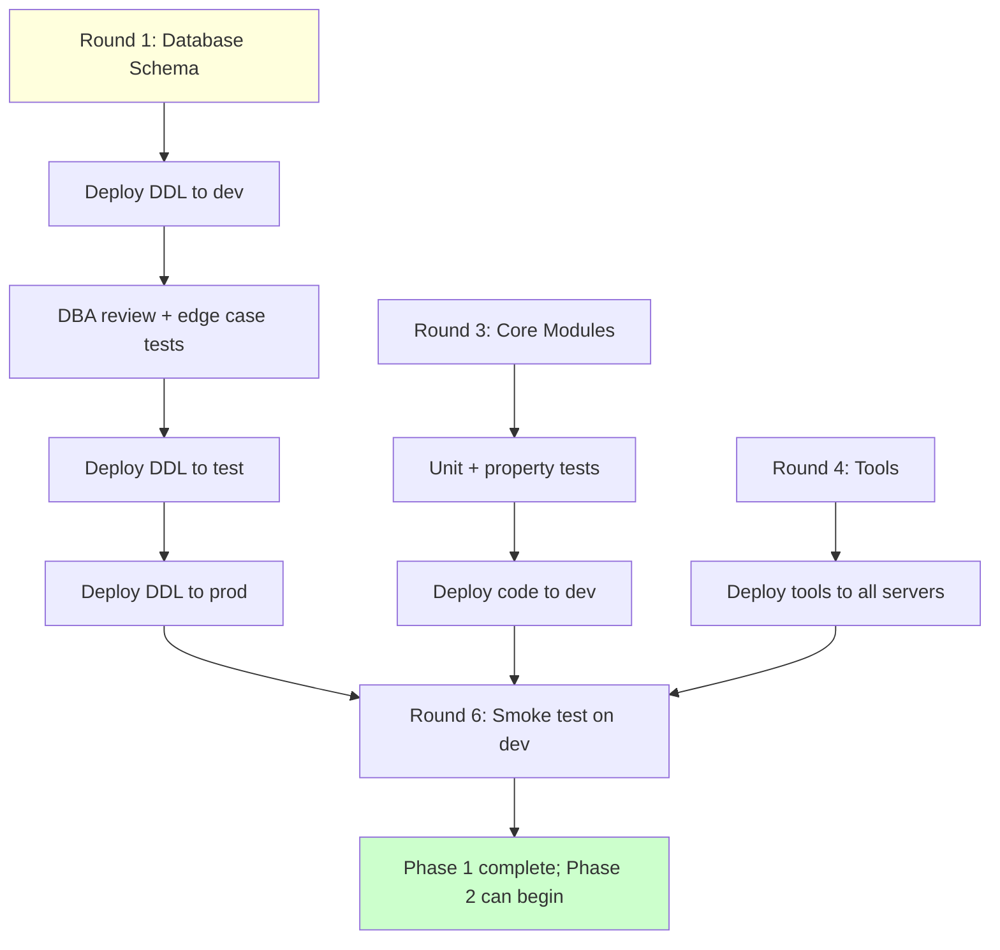

# Phase 1 — Foundation Infrastructure

## Purpose

Build the durable infrastructure (database schema, configuration, core Python modules, operator tools, tests, deployment to dev/test/prod) that every subsequent phase depends on. Phase 1 ends when a smoke-test pipeline runs end-to-end on dev — no real data, just the wiring.

## Why this phase exists

Without Phase 1, the rest of the plan has no substrate. Concretely:
- Phase 2 (Pilot) needs database tables to write to
- Phase 3 (Large tables) needs the windowed extraction modules
- Phase 4 (Production rollout) needs the operator tools and runbooks
- Phase 5 (Snowflake) needs the Parquet writer and registry
- Phase 6 (Health checks) needs the metadata tables to query

Phase 1 is also the highest-leverage phase for getting things right. Every database column added in Phase 1 is locked in for the lifetime of the pipeline; mistakes here compound. The deep-dive cycle (plan → validate → QA → edge cases → validate edge cases → sign-off) per round exists specifically because the cost of fixing mistakes after Phase 1 is high.

## For engineers

### Technical scope

Phase 1 produces the following artifacts:

- **~23 SQL Server tables** in `General.ops` (gate, ledger, event log, vault, provenance, etc.)
- **~10 stored procedures** (vault GET-OR-CREATE, gate management, retention enforcement)
- **~15 Python modules** (parquet writer, tokenizer, ledger, extraction state, range scheduler, etc.)
- **~12 operator tools** (verify parity, decrypt PII, detect gaps, enforce retention, etc.)
- **Unit + property-based test suites** (Tier 1 + Tier 2 from `06_TESTING.md`)
- **Configuration deployment** to all 3 servers with parity verification

### Key decisions affecting Phase 1 implementation

- D6 + D26 + D30: tokenization vault with append-only provenance, retention metadata, CCPA-aligned status
- D11 + D14: empirical lateness measurement; `IsReExtraction` and `ExtractionAttempt` columns
- D13: `is_date_trusted` rule for delete suppression
- D17: idempotency ledger pattern with startup recovery sweep
- D27: cross-server parity (Linux + RHEL + Python + libs identical)
- D29 + D33: Automic-driven failover with cooperative cancellation
- D34: greenfield deployment — all CREATE TABLE, no ALTER

### Anti-patterns to avoid

- **Don't introduce new open-source services.** No Vault, no Redis, no Kafka. Stay within Python `cryptography` (existing), Polars, pyodbc, ConnectorX.
- **Don't use UPSERT for audit/provenance tables.** Append-only preserves history per D26.
- **Don't pre-populate test data in vault tables.** Production vault rows must come from real source observation; test data goes in fixtures only.
- **Don't bypass the idempotency ledger** for any pipeline step. Every side-effecting operation gets a ledger row.
- **Don't log plaintext PII.** Use the sensitive_data_filter to enforce.

## For management

### Timeline

4-6 calendar weeks once Round 1 begins. Six rounds in sequence:
1. Database Schema (1-2 weeks)
2. Configuration (3-5 days)
3. Core Modules (1-2 weeks)
4. Tools (3-5 days)
5. Tests (1 week)
6. Deployment (3-5 days)
7. Schema Evolution Governance (3-5 days, parallel)

### Cost / risk

- **Engineering effort**: ~1.5-2 engineer-months (one engineer full-time + part-time DBA + part-time security review)
- **Infrastructure cost**: $0 incremental (uses existing SQL Server, Linux servers, network drive)
- **Risk**: medium-low — well-defined scope, no production data at risk during Phase 1, all changes reversible until production rollout (Phase 4)

### Business value

- Establishes the audit-grade foundation for regulatory compliance (CCPA/CPRA/GLBA)
- Enables idempotent re-runs (operational reliability)
- Sets up Power BI dashboards for ops visibility
- Without Phase 1, no production deployment is possible

## For auditors

Phase 1 establishes the following audit posture:

- **Process attestation**: every pipeline step records to `PipelineEventLog` with structured metadata
- **Detailed narrative logging**: `PipelineLog` captures the diagnostic trail; cross-referenced by `BatchId`
- **PII tokenization**: vault + provenance + access log; right-to-deletion supported via Status column
- **Retention controls**: 7-year default; legal-hold override; monthly enforcement job
- **Cross-server parity**: dev/test/prod identical, verified at every pipeline startup
- **Idempotency**: ledger gates prove each step's status; replay produces zero net writes on unchanged source

Auditors can query Phase 1 artifacts via Power BI dashboards (planned in Phase 6 but accessible from Phase 1 onwards).

## For operators

After Phase 1 completes, operators have:

- `tools/verify_server_parity.py` — verify dev/test/prod match
- `tools/parquet_verify.py` — check Parquet integrity
- `tools/detect_extraction_gaps.py` — find missing extraction dates
- `tools/decrypt_pii.py` — authorized decryption with audit trail
- `tools/enforce_retention.py` — monthly retention enforcement
- `tools/process_ccpa_deletion.py` — CCPA right-to-deletion processor
- Power BI dashboard skeletons (data flows in once pilot runs)

Day-to-day pipeline operation does NOT change after Phase 1 — operators continue using the existing pipeline. Phase 1 just deploys the new infrastructure. The change to operations comes in Phase 2 (pilot) when the first table runs the new flow.

## Visuals

### Phase 1 round dependency

See `09_VISUALS.md` §7 for the round dependency graph.

### Foundation deployment flow

## Round-by-round outline

| Round | Topic | Document | Status |
|---|---|---|---|
| 1 | Database Schema | `01_database_schema.md` (next deliverable) | ⬜ |
| 2 | Configuration | `02_configuration.md` (later) | ⬜ |
| 3 | Core Modules | `03_core_modules.md` (later) | ⬜ |
| 4 | Tools | `04_tools.md` (later) | ⬜ |
| 5 | Tests | `05_tests.md` (later) | ⬜ |
| 6 | Deployment | `06_deployment.md` (later) | ⬜ |
| 7 | Schema Evolution Governance | `07_schema_evolution_governance.md` (later) | ⬜ |

## Phase 1 acceptance criteria (gate to Phase 2)

- All Round 1-7 sign-offs in `03_DECISIONS.md`
- Database schema deployed to dev/test/prod (parity verified)
- All Tier 1 + Tier 2 tests green
- Smoke test pipeline (no real data) runs end-to-end on dev
- Code review complete, all reviewer comments resolved
- Operational runbooks (RB-1 through RB-11) reviewed and tested in dev where applicable
- Power BI dashboard files committed (even if no data yet)
- All open 🔴 edge cases addressed; all 🟡 cases have a documented mitigation plan

## How to update this document

This is a living document for Phase 1. Update when:
- A new round is added or removed
- A round's status changes
- A new key decision affects Phase 1 scope
- An anti-pattern is discovered and worth documenting

Per-round documents (`01_database_schema.md`, etc.) get created as each round begins; this overview links to them.
