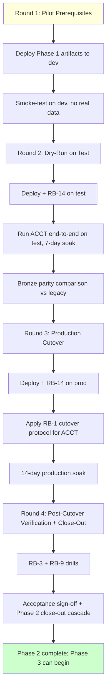
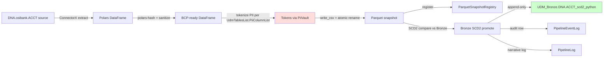

# Phase 2 — Pilot Table Cutover

**Status**: 🟢 Locked 2026-05-12 (pipeline-lead sign-off received; Round 1 may begin per prereqs). This is the **deep-dive plan** for Phase 2, paralleling `phase1/00_phase_overview.md`. Each Round produces a sibling spec doc (Round 1 → `phase2/01_pilot_prerequisites.md`, etc.) authored via the same D55 + D56 + D62 + D72 + Pattern E + Pattern F discipline stack.

## Purpose

Run the new pipeline (Parquet snapshot + tokenization vault + SCD2 promotion) end-to-end against a single small source table — `DNA.osibank.ACCT` (1.2M rows; per **D104**) — and validate that the Bronze output is identical to the legacy pipeline. Phase 2 ends when ACCT has run on the new flow daily for 14 consecutive days with zero operator intervention and Bronze hash + count + active-flag are bit-for-bit identical to the legacy pipeline.

## Why this phase exists

Phase 1 built the infrastructure (23 tables, 13 stored procedures, ~17 Python modules, 11 operator tools, 14 runbooks). Phase 1 also produced ~30 D-numbered decisions about CDC mechanics, idempotency invariants, error handling, and security posture — but none of those decisions have been validated end-to-end against real production data. Phase 2 is the first time the wiring carries current.

Concretely, Phase 2 must validate:
- **D104** — `DNA.osibank.ACCT` is the right pilot (1.2M rows; large enough to exercise CDC + SCD2 + reconciliation; small enough to iterate)
- **D6 + D26 + D30** — vault tokenization + provenance + 7-year retention work on a real table
- **D11 + D14** — empirical lateness (`L_99`) + `IsReExtraction` work with real ACCT data
- **D15 + D16 + D17** — idempotency invariants hold under production load
- **D27 + D65 + D103** — cross-server parity + parity baseline + Claude Code security model survive a full deploy
- **D29 + D33** — Automic-driven failover + cooperative cancellation work for a real run
- **D45.2** — Parquet file sizing (100-250 MB) is achievable for ACCT-sized batches
- **D71** — Snowflake RSA key auth + ephemeral `/dev/shm` key file
- **D84 + D85 + D86 + D87** — deployment artifact + module startup sequence + 3-env cadence + checklist
- **D102** — AES-256-GCM PiiVault encryption survives round-trip with real PII data
- **D105** — SQL naming standards apply cleanly to any net-new procs/views surfaced during pilot

Phase 2 is also the gate to Phase 3. Phase 3 (Large Tables) cannot start until the pilot table proves the foundation works.

## For engineers

### Technical scope

Phase 2 produces the following artifacts:

- **One pilot table running on the new flow**: `UDM_Bronze.DNA.ACCT_scd2_python` (or stripped-suffix per SS-1 if pre-migrated) populated by Parquet-snapshot path
- **Parity comparison report**: legacy-pipeline Bronze vs new-pipeline Bronze (row count, hash distribution, active-flag count) at end of dry-run + production-cutover Rounds
- **Production audit-row trail**: every step (extract, tokenize, write Parquet, SCD2 promote, vault decrypt, retention enforce) captured in `PipelineEventLog` + `PipelineLog`
- **Operator drill outputs**: RB-3 (gap recovery) + RB-9 (auto-failover) + RB-12 (deploy) + RB-14 (`.env` migration) each exercised once during Phase 2
- **Power BI dashboard skeleton with live data**: ACCT throughput / freshness / row-count trends visible
- **Phase 2 acceptance sign-off**: documented in `03_DECISIONS.md` as the D-number locking Phase 2 close-out

### Key decisions affecting Phase 2 implementation

- **D104** — pilot table = `DNA.osibank.ACCT` (1.2M rows; "fine enough" per user 2026-05-11)
- **D103 + RB-14** — `.env` migration `/debi/.env` → `/etc/pipeline/.env` MUST run on dev → test → prod before any Phase 2 deploy
- **D55 + D56 + D72 + Pattern E + Pattern F** — full validation discipline stack applies to every Phase 2 round close-out (same as Phase 1)
- **D62** — Canonical Context Load mandatory for every agent + skill invocation during Phase 2
- **D85** — module startup sequence (credentials_loader → vault pool → parity verifier → ledger sweep → orchestration) MUST run clean at every pipeline start
- **D87** — pre/post-deploy checklist contract (12 pre-check + 10 post-check) gates every environment promotion

### Anti-patterns to avoid

- **Don't truncate ACCT Bronze.** Append-only per D34 + SCD2 invariants; if cutover-rollback is needed, RB-1 §rollback handles it without truncation.
- **Don't run new + legacy pipelines concurrently against the same Bronze table.** `sp_getapplock` (P1-2) prevents this, but the orchestration must respect the lock — the cutover sets `UdmTablesList.CDCMode = 'parquet_snapshot'` AS the switch.
- **Don't skip the dry-run on test.** R5C5 / R6C7 / R8C9 precedent (Phase 1) shows that the final verify-clean cycle catches what every prior cycle missed. Same discipline applies at the Phase level.
- **Don't ship to prod before Round 0.5 spike** (D47 — D6/D16/D29 integrations). If Round 0.5 hasn't run, that's a 🔴 gate on Phase 2.
- **Don't promote test → prod without the 14-day soak.** Phase 2 acceptance criteria require the soak; D86 weekly-Monday-window cadence applies but the *soak duration* is Phase-2-specific (longer than D86's standard 168h test soak because this is the first production cutover).
- **Don't author new SP/view names violating D105.** Any Phase 2 surfacing of a new diagnostic SP (e.g. `ProcVerifyPilotParity`) must apply the D105 convention from the first commit.

## For management

### Timeline

3-5 calendar weeks once Round 1 begins. Four rounds in sequence:

1. **Round 1: Pilot Prerequisites** (3-5 days) — RB-14 .env migration on all 3 servers; deploy Phase 1 artifacts to dev/test/prod with parity verified; smoke-test pipeline runs end-to-end on dev (no real data)
2. **Round 2: Dry-Run on Test** (7-10 days, including 7-day soak) — run ACCT end-to-end on test environment; compare Bronze output to legacy; idempotency proofs
3. **Round 3: Production Cutover** (1 day cutover + 14-day soak) — apply RB-1 per-table cutover to ACCT in prod; new pipeline writes ACCT Bronze; legacy pipeline keeps writing other tables
4. **Round 4: Post-Cutover Verification + Phase 2 Close-Out** (2-3 days post-soak) — drill exercises (RB-3 gap recovery; RB-9 auto-failover); acceptance sign-off; Phase 2 close-out cascade

### Cost / risk

- **Engineering effort**: ~0.5-1 engineer-month (one engineer full-time + part-time operator + part-time DBA for cutover step + part-time security review)
- **Infrastructure cost**: $0 incremental (uses existing dev/test/prod servers + already-paid Snowflake trial); Phase 2 does NOT write to the Snowflake mirror — that's deferred to Phase 5
- **Risk**: medium — first production use of the new flow, but limited blast radius (single table). Roll back via RB-1 rollback (`UPDATE UdmTablesList SET CDCMode = 'legacy' WHERE SourceObjectName = 'ACCT'`) returns ACCT to the legacy path within minutes
- **Active delivery risks** (per RISKS.md):
  - R02 (Round 0.5 spike not executed) — 🔴 blocker for Phase 2 R3; Phase 2 R1 acceptance requires R02 closed
  - R32 (Claude credential-access) — ⚪ post-mitigation via D103; RB-14 enforces

### Business value

- First evidence that the rebuild works on real data — unblocks Phase 3 (large tables) + Phase 5 (Snowflake)
- Operator confidence: 14-day soak with zero intervention demonstrates the new flow is ready for incremental cohort rollout in Phase 4
- Pilot bronze table becomes the comparison baseline for every subsequent cohort cutover
- Power BI dashboards populated with real data → executives see the new pipeline operationally

## For auditors

Phase 2 establishes the following audit posture (additive to Phase 1):

- **First-production tokenization**: PiiVault rows populated for ACCT's PII columns; provenance traceable end-to-end
- **First-production decrypt event**: at least one RB-4 authorized decryption exercised during Phase 2; PiiVaultAccessLog row demonstrates the trail
- **Parity attestation**: legacy-vs-new Bronze comparison report archived as Phase 2 deliverable; signed by pipeline lead + DBA + compliance
- **Cutover audit row**: `PipelineEventLog` row with `EventType = 'CDC_MODE_CUTOVER'` for ACCT marks the exact transition timestamp
- **Drill evidence**: RB-3 gap recovery + RB-9 failover drill outputs archived; demonstrates operational readiness

## For operators

After Phase 2 completes, operators have:

- **ACCT running on the new flow** — daily extraction + Parquet snapshot + Bronze SCD2 promote, with zero manual intervention required
- **Power BI dashboard for ACCT**: throughput / freshness / row-count trends visible
- **Drill confidence**: RB-3 + RB-9 + RB-12 + RB-14 each have been exercised at least once in test or prod; runbooks now reflect lessons-learned
- **Legacy pipeline still running for non-ACCT tables** — Phase 4 will extend the cutover cohort-by-cohort

Day-to-day operations change for ACCT only:
- AM/PM cycle now invokes the new flow for ACCT (legacy code path skipped for that table)
- ACCT's Bronze writes are visible via `PipelineEventLog` (new) instead of legacy log table
- ACCT errors surface in `PipelineLog` (new) instead of legacy error log

## Visuals

### Phase 2 round dependency

### Phase 2 pilot data flow

## Round-by-round outline

| Round | Topic | Document | Status |
|---|---|---|---|
| 1 | Pilot Prerequisites | `phase2/01_pilot_prerequisites.md` (canonical) + `phase2/01a_execution_order.md` (R1a/R1b/R1c micro-round sequencing companion) | 🟢 Locked 2026-05-12 per D88 convergence-confirmed acceptance precedent (6-cycle Pattern E campaign; 23 🔴 caught + fixed; 1 🔴 carryover via B200; trajectory 11→6→3→2→1→1; pipeline-lead sign-off pending for R1 execution authorization; § 4.1 execution still blocked on B197 SELinux gap; sub-step sequencing chunked into 3 micro-rounds per 01a) |
| 2 | Dry-Run on Test | `phase2/02_dry_run_test.md` (later) | ⬜ |
| 3 | Production Cutover | `phase2/03_production_cutover.md` (later) | ⬜ |
| 4 | Post-Cutover Verification + Close-Out | `phase2/04_post_cutover_verification.md` (later) | ⬜ |

### Round 1 — Pilot Prerequisites (target deliverable)

**Scope**:
- ✅ **B184 implementation — `tools/verify_credentials_load.py` CLI shim coded against spec** (engineer team agreed 2026-05-12; staffing-accepted, coding pending) — Round 4.5 supplement § 3 spec ⚫ CLOSED 2026-05-11; WSJF 4.0; hard prerequisite for RB-14 pre-flight smoke test. Implements Tool 12 per the canonical spec at `phase1/04a_phase_0_prep_tools.md` § 3.
- 🟢 RB-14 `.env` migration run + validated on dev → test → prod (per-server, in sequence with check-pause-check) — B182 ⚫ CLOSED; runbook ready; awaits engineer execution per RB-14 procedure
- 🔴 All Phase 1 Round 0.5 spike work complete (D47) — D6 vault, D16 stage-check-exchange, D29 Automic gate-table coordination empirically validated against running code (R02 still-blocking: staffing-accepted but NOT yet executed against running code)
- 🟢 Phase 1 artifacts deployed per D86 cadence: dev nightly on `main` HEAD, test daily after dev pass + 4h soak, prod weekly Monday window (artifacts ready; deploy ready)
- 🟢 All Tier 0 + Tier 1 + Tier 2 tests green per `phase1/05_tests.md` (tests authored; staffing-accepted; execution pending)
- 🟢 Smoke-test pipeline runs end-to-end on dev with synthetic data — no real ACCT (awaits implementation + deploy)
- ✅ **B183 implementation — Parity baseline JSON captured per Tool 13 spec** (engineer team agreed 2026-05-12; staffing-accepted) — Round 4.5 supplement § 4 spec ⚫ CLOSED 2026-05-11. `tools/capture_parity_baseline.py` coded against canonical spec at `phase1/04a_phase_0_prep_tools.md` § 4; all 3 servers verified parity-clean per Tool 13 + `verify_server_parity.py` (R4 § 3.7) chain
- ✅ **B188 (Tool 14) + B189 (Tool 15) + B190 (Tool 16) implementations engineer team agreed** 2026-05-12 (staffing-accepted; coding pending)
- ✅ **Dev/test/prod server access** — SMB/CIFS mount + credentials available on all 3 servers per 2026-05-12 confirmation; engineer environment ready

**Validation gate**:
- `tools/verify_credentials_load.py` PASS on all 3 servers
- `tools/verify_server_parity.py` PASS across dev/test/prod (zero fatal drift, ≤ 3 warning drift)
- `PipelineEventLog` shows clean `STARTUP_CREDS_LOAD` + `STARTUP_VAULT_CONFIG` + `STARTUP_PARITY_CHECK` + `STARTUP_LEDGER_SWEEP` + `STARTUP_ORCHESTRATION_START` events on dev smoke test
- All 17 Phase 1 modules import + Tier 0 smoke tests pass in < 5s each per D67
- RB-14 audit-row in `ManualCorrectionLog` for every server's migration

### Round 2 — Dry-Run on Test (target deliverable)

**Scope**:
- Full ACCT extract on test environment using the new flow
- Parquet snapshot written to test-tier network drive path
- Bronze SCD2 promotion populates `UDM_Bronze.DNA.ACCT_scd2_python` (test-environment Bronze)
- Parallel run: legacy pipeline also writes its Bronze to legacy-named table on test
- 7-day soak: daily extractions run, late updates captured per LookbackDays, reconciliation queries pass
- End-of-soak parity report compares the two Bronzes

**Validation gate**:
- Row counts identical (active flag 1 + 2 + 0 each row-count-equal)
- `UdmHash` distribution identical (every active PK's hash matches between the two Bronzes)
- `_cdc_is_current = 1` row count identical in respective Stage tables
- Re-run with same `BatchId` = zero Bronze writes (D15 idempotency)
- Re-run with new `BatchId` on unchanged source = zero Bronze writes
- One deliberate downtime test (stop pipeline for 6-12 hours, restart, RB-3 gap recovery exercised)
- PipelineEventLog has clean `TABLE_TOTAL` events for ACCT every day of soak, Status='SUCCESS'

### Round 3 — Production Cutover (target deliverable)

**Scope**:
- Deploy to prod per D86 weekly Monday window
- Apply RB-1 Per-Table Cutover protocol to ACCT in prod
- New pipeline writes ACCT Bronze in prod per D109 (AM Prod 02:00 weekdays + Test 06:00 weekdays; PM Prod 17:00 daily + Test 21:00 daily; SQL-table-based test↔prod coordination via PipelineExecutionGate per D29 + D33 + SP-3 + SP-4); D109 supersedes D106
- Legacy pipeline continues for non-ACCT tables
- 14-day production soak with daily monitoring + freshness alerting (per B-9: WARNING at 36h, ERROR at 48h)

**Validation gate**:
- Cutover audit row in `PipelineEventLog` with `EventType = 'CDC_MODE_CUTOVER'` for ACCT
- `UdmTablesList.CDCMode = 'parquet_snapshot'` for ACCT row
- Bronze parity vs legacy: identical for the cutover-day Batch and every subsequent day's run
- Zero `Status = 'FAILED'` events for ACCT during 14-day soak
- Zero operator intervention required during 14-day soak
- One authorized RB-4 PII decryption exercise on ACCT data, audit row visible

### Round 4 — Post-Cutover Verification + Phase 2 Close-Out (target deliverable)

**Scope**:
- RB-3 (gap recovery) drill: deliberate pipeline stop for 24-48 hours, restart, verify gap fill
- RB-9 (auto-failover) drill: induce AM-cycle prod-side failure, verify test-side acknowledgment + failover takeover (validates D109 schedule + PipelineExecutionGate coordination per D29 + D33 + SP-3 + SP-4)
- Final parity comparison (cutover-day + day-14 + cumulative)
- Power BI dashboard skeleton populated with ACCT data
- Phase 2 acceptance sign-off — D-numbered decision locking Phase 2 close
- Phase 2 close-out cascade: HANDOFF §3 lock list + §12 round history + §14 last-reviewed; CURRENT_STATE; NORTH_STAR decision list; GLOSSARY round codes; 02_PHASES Phase 2 status; BACKLOG carryover; RISKS delta; _validation_log
- Self-improvement loop (D95 + skill 8.A-8.G) runs once for Phase 2 R1-R4 at close-out per `SELF_IMPROVEMENT_DISCIPLINE.md`
- **B191 cross-ref** — Phase 5 plan timing gated on Snowflake-test conclusion per D112 (Round-N.5 just-in-time plan timing). Phase 2 close-out triggers re-evaluation of Phase 5 plan-draft readiness; do not author Phase 5 plan before Snowflake-test conclusion lands.

**Validation gate**:
- All 4 Phase 2 rounds 🟢 Locked with `_validation_log.md` entries
- All Phase 2 deliverables archived
- Phase 2 acceptance D-numbered decision 🟢 Locked at P2R4 close-out (D-number TBD; estimated D114-D116 range — D106 through D113 now locked at 2026-05-12, with D113 = POLISH_QUEUE.md cosmetic-tracker discipline)
- Pipeline lead sign-off documented
- Self-improvement loop produces 0-N delta proposals; user approves batch within session

## Phase 2 acceptance criteria (gate to Phase 3)

- All Round 1-4 sign-offs in `03_DECISIONS.md`
- ACCT running on the new flow daily for ≥ 14 consecutive days with zero operator intervention
- Bronze parity vs legacy: identical row count + active-flag count + `UdmHash` distribution + per-PK active version
- Idempotency proofs documented: same-BatchId re-run = no-op; new-BatchId on unchanged source = no-op
- RB-1 + RB-3 + RB-9 + RB-12 + RB-14 each exercised at least once during Phase 2
- Power BI ACCT dashboard skeleton displays live data
- Phase 1 carryover backlog items (B-numbers referenced from Round 1-7 carryover) triaged at Phase 2 close-out
- All open 🔴 edge cases addressed; all 🟡 cases have a documented mitigation plan
- Phase 2 close-out cascade verified clean via Pattern F (D89-D91)

## How to update this document

This is a living document for Phase 2. Update when:
- A new round is added or removed
- A round's status changes (⬜ → 🟡 → 🟢)
- The pilot table scope shifts (D104 supersession)
- A new prerequisite is identified (e.g., a Phase 1 carryover surfaces a blocker)
- Acceptance criteria gain or lose items (must be done via D-numbered supersession)

## Cross-references

- **02_PHASES.md § Phase 2** — top-level phase definition (this doc operationalizes it)
- **phase1/00_phase_overview.md** — Phase 1 template that this doc parallels
- **D104** — pilot table choice (DNA.osibank.ACCT)
- **D103 + RB-14** — `.env` migration prerequisite
- **D86 + D87 + D88 + RB-12** — deployment cadence + checklist + acceptance + runbook (Phase 1 R6 outputs Phase 2 consumes)
- **CHECKS_AND_BALANCES.md** — 5-gate validation discipline applied to each Round
- **NORTH_STAR.md** — pillar priority for every Phase 2 trade-off
- **SECURITY_MODEL.md** — D103 13-layer defense; RB-14 is its operational manifestation
